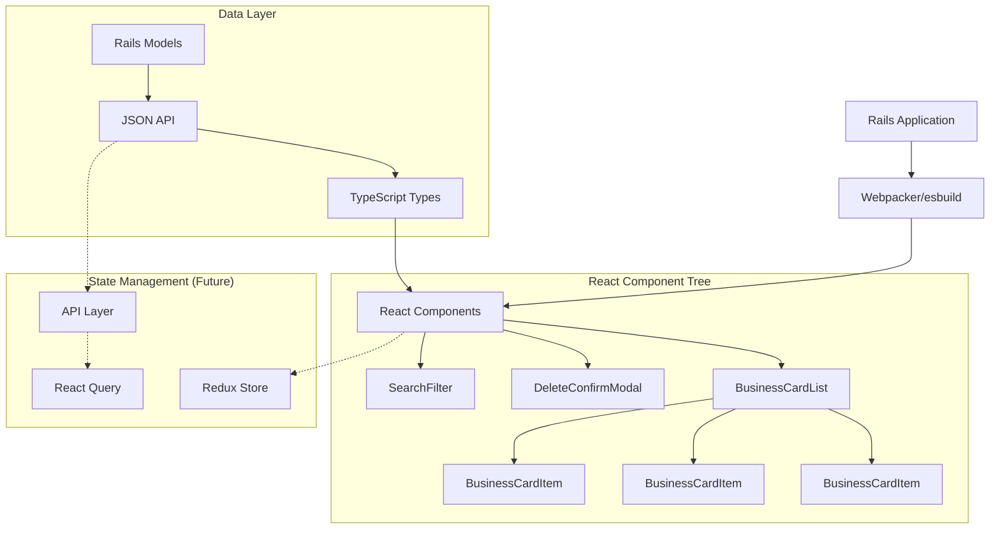
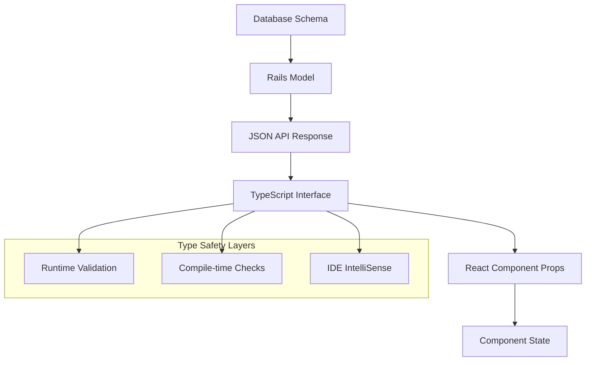
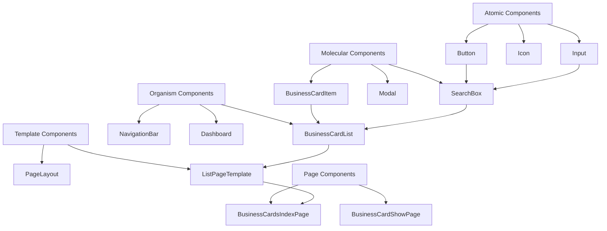
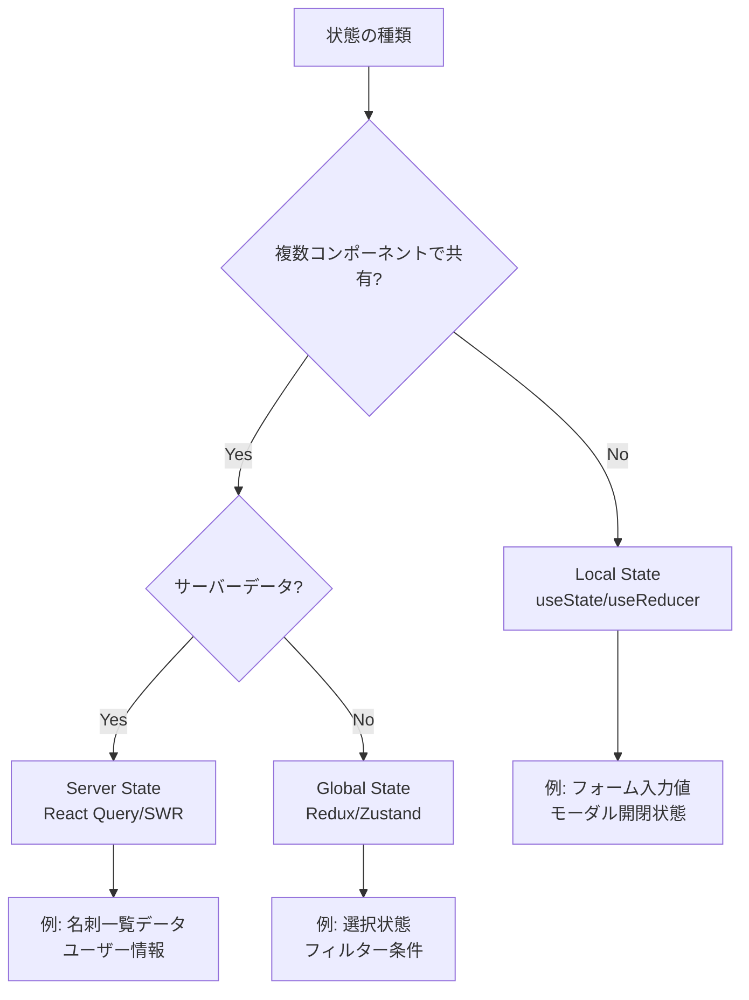
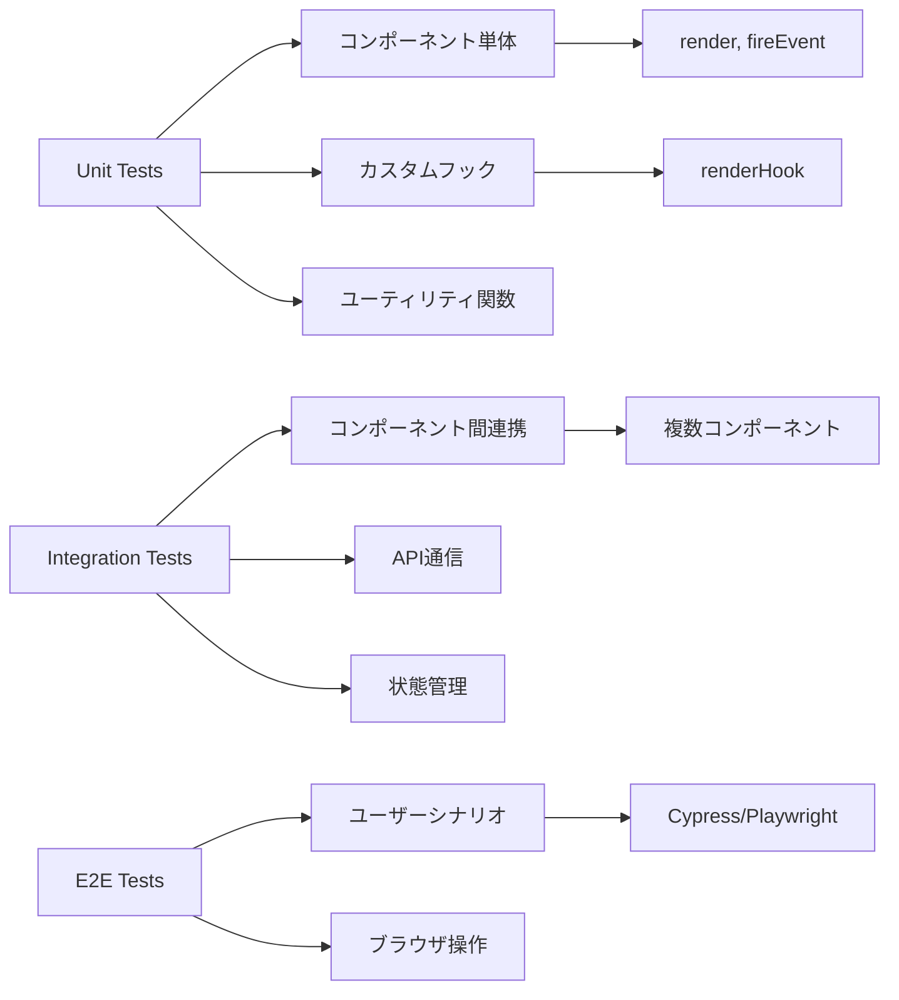
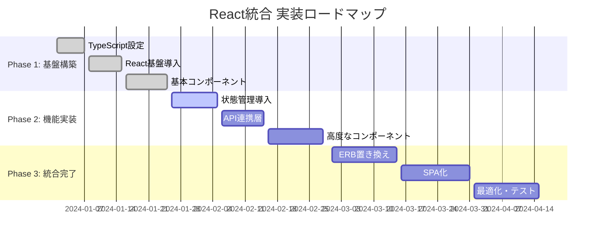
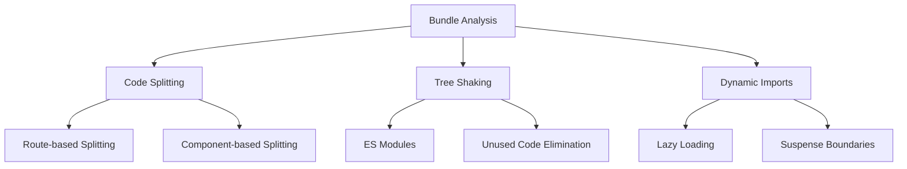

# React + TypeScript アーキテクチャ詳細解説

## 🏗️ システムアーキテクチャ全体像

### コンポーネント階層とデータフロー



### ディレクトリ構造の設計原則

```
app/javascript/
├── components/              # UIコンポーネント（原子〜分子レベル）
│   ├── business_cards/      # 名刺関連コンポーネント群
│   │   ├── BusinessCardItem.tsx
│   │   ├── BusinessCardList.tsx
│   │   └── DeleteConfirmModal.tsx
│   ├── common/              # 共通UIコンポーネント
│   │   ├── Button.tsx
│   │   ├── Modal.tsx
│   │   └── LoadingSpinner.tsx
│   └── layout/              # レイアウトコンポーネント
│       ├── Header.tsx
│       └── Sidebar.tsx
├── types/                   # TypeScript型定義
│   ├── business_card.ts     # 名刺関連型
│   ├── user.ts             # ユーザー関連型
│   └── api.ts              # API レスポンス型
├── hooks/                   # カスタムフック（Future）
│   ├── useBusinessCards.ts
│   └── useApi.ts
├── utils/                   # ユーティリティ関数
│   ├── validation.ts
│   └── formatting.ts
└── store/                   # Redux関連（Future）
    ├── slices/
    └── api/
```

## 🔧 TypeScript型システムの設計

### 型安全性の階層構造



### 実装例: 型の継承関係

```typescript
// 基底型: データベースから取得される完全なエンティティ
export interface BusinessCard {
  id: number;
  name: string;
  company_name: string;
  // ... 全フィールド
  created_at: string;
  updated_at: string;
  user_id: number;
}

// 派生型1: フォーム送信用（IDや日時を除外）
export interface BusinessCardFormData extends
  Omit<BusinessCard, 'id' | 'created_at' | 'updated_at' | 'user_id'> {}

// 派生型2: 一覧表示用（最小限のフィールド）
export interface BusinessCardSummary extends
  Pick<BusinessCard, 'id' | 'name' | 'company_name' | 'job_title'> {}

// 派生型3: 検索結果用（オプショナルフィールド多数）
export interface BusinessCardSearchResult extends Partial<BusinessCard> {
  id: number; // IDは必須
  name: string; // 名前は必須
}
```

### APIレスポンス型の標準化

```typescript
// 標準的なAPIレスポンス構造
export interface ApiResponse<T> {
  data: T;
  message?: string;
  errors?: string[];
  meta?: {
    page?: number;
    per_page?: number;
    total?: number;
  };
}

// 具体的な使用例
export type BusinessCardListResponse = ApiResponse<BusinessCard[]>;
export type BusinessCardDetailResponse = ApiResponse<BusinessCard>;

// エラーハンドリング型
export interface ApiError {
  status: number;
  message: string;
  details?: Record<string, string[]>;
}
```

## ⚛️ React コンポーネント設計パターン

### コンポーネント分類と責務



### 実装パターン詳細

#### 1. Presentation Component パターン
```typescript
// プレゼンテーション層: UIの表示のみに専念
interface BusinessCardItemProps {
  businessCard: BusinessCard;
  onEdit: (card: BusinessCard) => void;
  onDelete: (id: number) => void;
  onSelect: (id: number) => void;
  isSelected?: boolean;
  isLoading?: boolean;
}

export const BusinessCardItem: React.FC<BusinessCardItemProps> = ({
  businessCard,
  onEdit,
  onDelete,
  onSelect,
  isSelected = false,
  isLoading = false
}) => {
  // ビジネスロジックは含まない
  // UIの表示とイベントの委譲のみ
};
```

#### 2. Container Component パターン（Future）
```typescript
// コンテナ層: データ取得とビジネスロジックを担当
export const BusinessCardItemContainer: React.FC<{ cardId: number }> = ({ cardId }) => {
  const { card, isLoading, error } = useBusinessCard(cardId);
  const { deleteCard, updateCard } = useBusinessCardActions();

  const handleDelete = useCallback((id: number) => {
    if (window.confirm('削除しますか？')) {
      deleteCard(id);
    }
  }, [deleteCard]);

  if (error) return <ErrorMessage error={error} />;
  if (!card) return <LoadingSpinner />;

  return (
    <BusinessCardItem
      businessCard={card}
      onDelete={handleDelete}
      onEdit={updateCard}
      isLoading={isLoading}
    />
  );
};
```

### 状態管理パターン

#### Local State vs Global State の判断基準



## 🧪 Testing Library 実践パターン

### テスト分類と目的



### テストケース設計パターン

#### AAA パターン（Arrange-Act-Assert）
```typescript
describe('BusinessCardItem', () => {
  it('削除ボタンクリック時にonDelete関数が呼ばれる', () => {
    // Arrange: テストデータとモックの準備
    const mockCard = createMockBusinessCard();
    const mockOnDelete = jest.fn();

    render(
      <BusinessCardItem
        businessCard={mockCard}
        onDelete={mockOnDelete}
      />
    );

    // Act: ユーザーアクションの実行
    fireEvent.click(screen.getByTestId('delete-button'));

    // Assert: 期待される結果の検証
    expect(mockOnDelete).toHaveBeenCalledWith(mockCard.id);
    expect(mockOnDelete).toHaveBeenCalledTimes(1);
  });
});
```

#### カスタムレンダー関数パターン
```typescript
// テストユーティリティ
function renderBusinessCardItem(
  props: Partial<BusinessCardItemProps> = {}
) {
  const defaultProps: BusinessCardItemProps = {
    businessCard: createMockBusinessCard(),
    onDelete: jest.fn(),
    onEdit: jest.fn(),
    ...props
  };

  return {
    ...render(<BusinessCardItem {...defaultProps} />),
    props: defaultProps
  };
}

// 使用例
it('名前が表示される', () => {
  const { props } = renderBusinessCardItem({
    businessCard: { ...createMockBusinessCard(), name: '田中太郎' }
  });

  expect(screen.getByText('田中太郎')).toBeInTheDocument();
});
```

## 🔄 Rails統合の実装戦略

### 段階的移行のロードマップ



### Webpacker/esbuild 統合パターン

#### エントリーポイント構成
```javascript
// app/javascript/packs/application.js
import Rails from '@rails/ujs';
import Turbo from '@hotwired/turbo-rails';
import * as ActiveStorage from '@rails/activestorage';

// React コンポーネント
import { initializeReactComponents } from '../components/initializer';

Rails.start();
Turbo.start();
ActiveStorage.start();

// Turbo対応のReact初期化
document.addEventListener('turbo:load', initializeReactComponents);
```

#### Rails View との連携
```erb
<!-- app/views/business_cards/index.html.erb -->
<div id="business-cards-react-root"
     data-cards="<%= @business_cards.to_json %>"
     data-current-user="<%= current_user.to_json %>">
</div>

<script>
  document.addEventListener('turbo:load', () => {
    const rootElement = document.getElementById('business-cards-react-root');
    if (rootElement) {
      // React コンポーネントの初期化
      ReactDOM.render(
        <BusinessCardList
          initialCards={JSON.parse(rootElement.dataset.cards)}
          currentUser={JSON.parse(rootElement.dataset.currentUser)}
        />,
        rootElement
      );
    }
  });
</script>
```

## 📈 パフォーマンス最適化戦略

### バンドルサイズ最適化



### React最適化テクニック

```typescript
// 1. メモ化によるレンダリング最適化
const BusinessCardItem = React.memo<BusinessCardItemProps>(({
  businessCard,
  onDelete
}) => {
  // コンポーネント実装
}, (prevProps, nextProps) => {
  // カスタム比較関数
  return prevProps.businessCard.id === nextProps.businessCard.id &&
         prevProps.businessCard.updated_at === nextProps.businessCard.updated_at;
});

// 2. useCallback による関数メモ化
const BusinessCardList: React.FC = () => {
  const handleDelete = useCallback((id: number) => {
    // 削除処理
  }, [/* 依存配列 */]);

  return (
    <div>
      {cards.map(card => (
        <BusinessCardItem
          key={card.id}
          businessCard={card}
          onDelete={handleDelete}
        />
      ))}
    </div>
  );
};

// 3. useMemo による計算結果キャッシュ
const filteredCards = useMemo(() => {
  return cards.filter(card =>
    card.name.includes(searchQuery) ||
    card.company_name.includes(searchQuery)
  );
}, [cards, searchQuery]);
```

## 🔒 セキュリティ考慮事項

### XSS対策とデータ検証

```typescript
// 1. 型レベルでの検証
interface SafeBusinessCard {
  id: number;
  name: string; // HTMLエスケープ済み
  company_name: string; // HTMLエスケープ済み
  // ...
}

// 2. ランタイム検証
const validateBusinessCard = (data: unknown): data is BusinessCard => {
  return (
    typeof data === 'object' &&
    data !== null &&
    typeof (data as any).id === 'number' &&
    typeof (data as any).name === 'string' &&
    (data as any).name.length > 0 &&
    typeof (data as any).company_name === 'string'
  );
};

// 3. CSRFトークン統合
const apiCall = async (endpoint: string, data: any) => {
  const token = document.querySelector('meta[name="csrf-token"]')?.getAttribute('content');

  return fetch(endpoint, {
    method: 'POST',
    headers: {
      'Content-Type': 'application/json',
      'X-CSRF-Token': token || ''
    },
    body: JSON.stringify(data)
  });
};
```

---

*この詳細解説は、Task 13で構築したReact + TypeScript基盤の技術的背景と、将来の拡張性を考慮した設計思想を記録したものです。実装時の参考資料として活用してください。*