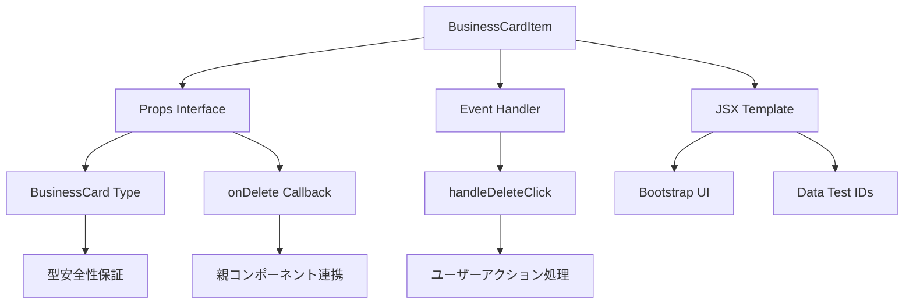
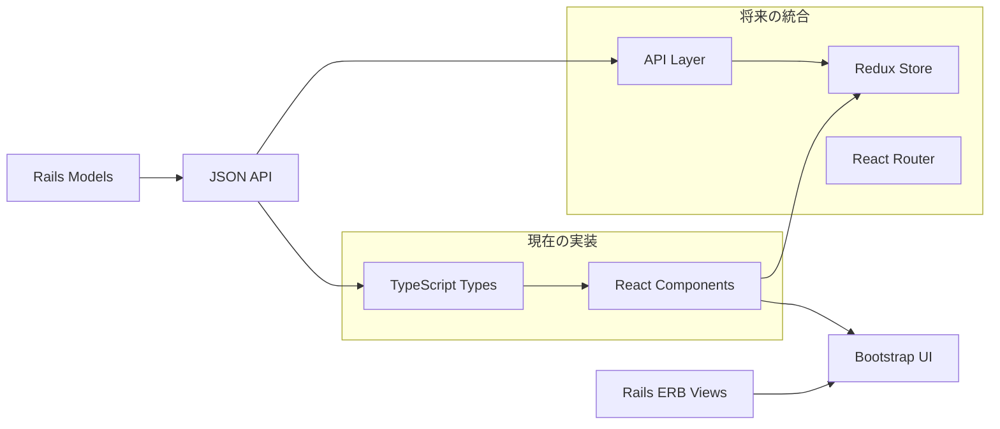

# Task 13 学習ポイント: React + TypeScript 統合の実践

## 概要

タスク13では、Business Card ManagerプロジェクトにReact + TypeScript基盤を導入し、最初のコンポーネント（BusinessCardItem）を実装しました。この文書では、TDDサイクルを通じて学んだ技術的知見と実装パターンを詳細に記録します。

## 🎯 実装目標と成果

### 実装した機能
- BusinessCardItemコンポーネント（名刺カード表示）
- TypeScript型定義（BusinessCard インターフェース）
- React Testing Library による包括的テスト
- Rails + React 統合基盤の構築

### TDDで検証した品質項目
- ✅ UI表示の正確性（名前、会社名、役職）
- ✅ イベントハンドリング（削除ボタンクリック）
- ✅ プロパティ受け渡しの型安全性
- ✅ アクセシビリティ対応（data-testid属性）

## 🏗️ アーキテクチャ設計

### ディレクトリ構造

```
app/javascript/
├── components/           # Reactコンポーネント
│   └── BusinessCardItem.tsx
├── types/               # TypeScript型定義
│   └── business_card.ts
└── ...

spec/javascript/
├── components/          # コンポーネントテスト
│   └── BusinessCardItem.spec.tsx
├── setup.ts            # Jest + Testing Library設定
└── ...

config/
├── jest.config.js      # Jest設定ファイル
├── tsconfig.json       # TypeScript設定
└── ...
```

### コンポーネント設計パターン



## 🔧 技術実装の詳細

### 1. TypeScript 型定義の設計

#### BusinessCard インターフェース
```typescript
export interface BusinessCard {
  id: number;
  name: string;              // 必須項目
  company_name: string;      // 必須項目
  job_title?: string;        // オプション項目
  email?: string;
  phone?: string;
  // ... その他のフィールド
  created_at: string;        // ISO 8601 形式
  updated_at: string;
  user_id: number;
}
```

**設計ポイント:**
- Railsモデルのフィールド名と完全一致
- オプショナル項目（`?`）による柔軟性
- 日時フィールドはstring型（JSON API対応）

#### Props 型定義
```typescript
interface BusinessCardItemProps {
    businessCard: BusinessCard;
    onDelete: (id: number) => void;
}
```

**設計ポイント:**
- 単一責任原則: 1つの名刺データのみを扱う
- コールバック関数の型を明示的に定義
- 親コンポーネントとの疎結合を実現

### 2. React コンポーネント実装

#### 関数コンポーネントパターン
```typescript
export const BusinessCardItem: React.FC<BusinessCardItemProps> = ({
    businessCard,
    onDelete
}) => {
    // イベントハンドラの実装
    const handleDeleteClick = () => {
        onDelete(businessCard.id);
    };

    return (
        // JSX テンプレート
    );
};
```

**学習ポイント:**
- `React.FC<Props>` 型を使用した型安全な関数コンポーネント
- 分割代入によるpropsの明確な受け取り
- イベントハンドラの分離による可読性向上

#### Bootstrap 統合
```jsx
<div className="card mb-3" data-testid="business-card-item">
    <div className="card-body">
        <h5 className="card-title">{businessCard.name}</h5>
        <h6 className="card-subtitle mb-2 text-muted">{businessCard.company_name}</h6>
        <!-- ... -->
    </div>
</div>
```

**設計考慮点:**
- Bootstrapクラスによる一貫したスタイリング
- セマンティックなHTML構造
- テスト可能性を考慮したdata-testid属性

### 3. Testing Library によるテスト実装

#### テスト構造
```typescript
describe('BusinessCardItem', () => {
    const mockOnDelete = jest.fn();

    beforeEach(() => {
        mockOnDelete.mockClear();
    });

    describe('名刺情報の表示', () => {
        // UI表示テスト
    });

    describe('削除機能', () => {
        // イベント処理テスト
    });
});
```

**テスト設計パターン:**
- **Arrange-Act-Assert** パターンの実践
- **モック関数** による外部依存の分離
- **ネストしたdescribe** による論理的グルーピング

#### ユーザーインタラクションテスト
```typescript
it('削除ボタンクリック時にonDelete関数が正しいIDで呼ばれる', () => {
    render(<BusinessCardItem businessCard={mockBusinessCard} onDelete={mockOnDelete} />);

    fireEvent.click(screen.getByTestId('delete-button'));

    expect(mockOnDelete).toHaveBeenCalledWith(1);
    expect(mockOnDelete).toHaveBeenCalledTimes(1);
});
```

**テスト品質のポイント:**
- **実際のユーザー操作** をシミュレート
- **関数呼び出しの検証** （引数と回数）
- **テストの独立性** を確保

## 🔄 Rails統合アーキテクチャ

### 現在の統合状況



### 段階的移行戦略

1. **現在（Phase 1）**: 単体コンポーネントの実装
   - ✅ BusinessCardItem完成
   - 🔄 BusinessCardList（次のタスク）
   - 🔄 DeleteConfirmModal

2. **Phase 2**: 状態管理統合
   - Redux Toolkit導入
   - API通信層の実装
   - Rails APIエンドポイント作成

3. **Phase 3**: 完全統合
   - ERBビューからReactへの置き換え
   - SPA化とReact Router導入

## 📋 設定ファイルの詳細

### tsconfig.json の React 対応
```json
{
  "compilerOptions": {
    "jsx": "react-jsx",        // React 17+ の新しいJSX変換
    "lib": ["ES2022", "DOM"],  // DOM型定義を含む
    "moduleResolution": "node", // Node.js互換のモジュール解決
    // ...
  }
}
```

### Jest 設定の React 対応
```javascript
module.exports = {
  testEnvironment: 'jsdom',              // DOM環境をシミュレート
  setupFilesAfterEnv: ['<rootDir>/spec/javascript/setup.ts'],
  moduleFileExtensions: ['ts', 'tsx', 'js', 'jsx'],  // React拡張子対応
  // ...
};
```

### package.json の依存関係
```json
{
  "dependencies": {
    "react": "^18.3.1",
    "react-dom": "^18.3.1"
  },
  "devDependencies": {
    "@testing-library/jest-dom": "^5.17.0",
    "@testing-library/react": "^13.4.0",
    "@types/react": "^18.3.24",
    "@types/react-dom": "^18.3.7"
  }
}
```

## 🎓 学習成果と次のステップ

### 習得した技術スキル

1. **TypeScript × React 開発フロー**
   - 型定義 → コンポーネント → テスト のTDDサイクル
   - 型安全性による開発効率とバグ削減効果を実感

2. **React Testing Library の実践的活用**
   - ユーザー視点でのテスト作成手法
   - モック・スタブを使った外部依存の分離

3. **Rails × モダンフロントエンド統合**
   - 既存プロジェクトへの段階的導入戦略
   - ビルドツール（esbuild）との連携

### 次のタスクへの準備状況

**Task 14準備完了項目:**
- ✅ React基盤とTypeScript設定
- ✅ テスト環境の整備
- ✅ 基本コンポーネントパターンの確立

**実装予定の発展機能:**
- BusinessCardList（複数カード表示）
- Redux状態管理統合
- API通信層の実装

## 📚 参考資料とベストプラクティス

### TypeScript + React ベストプラクティス
- インターフェース定義による明確な契約
- React.FCによる型安全なコンポーネント
- オプショナルプロパティの適切な活用

### Testing Library 推奨パターン
- ユーザー行動に基づくテストケース設計
- data-testid によるE2Eテスト連携準備
- モック関数による外部依存の分離

### Rails統合における注意点
- フィールド名の一貫性（snake_case vs camelCase）
- JSON APIレスポンス形式の標準化
- CSRFトークンとセキュリティ考慮

---

*この文書は、Task 13のTDDサイクル完了時点での学習成果をまとめたものです。実装コードと合わせて、Reactベースの機能開発における参考資料として活用してください。*