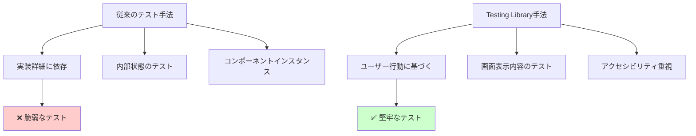
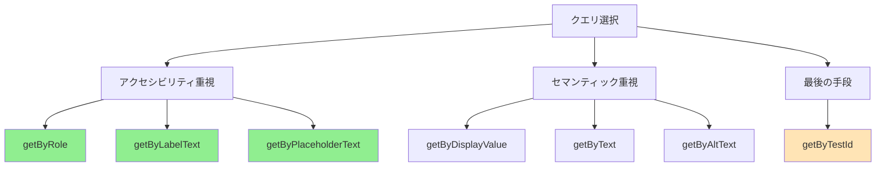

# React Testing Library 実践ガイド

## 🎯 Testing Library の哲学と原則

### 「ユーザーの視点でテストする」という思想

React Testing Libraryは「ユーザーがアプリケーションを使用する方法と同じ方法でテストする」という哲学に基づいています。



### 実践例: BusinessCardItem コンポーネント

#### ❌ 悪い例（実装詳細に依存）
```typescript
// 避けるべきテスト方法
it('コンポーネントのstate.nameが設定される', () => {
  const wrapper = shallow(<BusinessCardItem {...props} />);
  expect(wrapper.state('name')).toBe('田中太郎');
});

it('handleClickメソッドが呼ばれる', () => {
  const wrapper = shallow(<BusinessCardItem {...props} />);
  const instance = wrapper.instance();
  const spy = jest.spyOn(instance, 'handleClick');
  wrapper.find('.delete-button').simulate('click');
  expect(spy).toHaveBeenCalled();
});
```

#### ✅ 良い例（ユーザー視点）
```typescript
// 推奨されるテスト方法
it('名前が画面に表示される', () => {
  render(<BusinessCardItem businessCard={mockCard} onDelete={mockOnDelete} />);
  expect(screen.getByText('田中太郎')).toBeInTheDocument();
});

it('削除ボタンをクリックすると削除処理が実行される', () => {
  render(<BusinessCardItem businessCard={mockCard} onDelete={mockOnDelete} />);
  fireEvent.click(screen.getByRole('button', { name: '削除' }));
  expect(mockOnDelete).toHaveBeenCalledWith(mockCard.id);
});
```

## 🔍 クエリメソッドの選択戦略

### クエリの優先順位（推奨順）



### 実装例とベストプラクティス

#### 1. ロール（Role）ベースクエリ
```typescript
// ✅ 推奨: セマンティックな要素を活用
it('削除ボタンが存在し、クリック可能である', () => {
  render(<BusinessCardItem businessCard={mockCard} onDelete={mockOnDelete} />);

  // buttonロールを持つ要素を検索
  const deleteButton = screen.getByRole('button', { name: /削除/ });
  expect(deleteButton).toBeInTheDocument();
  expect(deleteButton).not.toBeDisabled();

  // クリック操作のテスト
  fireEvent.click(deleteButton);
  expect(mockOnDelete).toHaveBeenCalledWith(mockCard.id);
});

// より詳細なロール指定
it('名刺情報がheadingとして表示される', () => {
  render(<BusinessCardItem businessCard={mockCard} onDelete={mockOnDelete} />);

  // level 1のheadingとして名前が表示される
  expect(screen.getByRole('heading', { level: 5, name: '田中太郎' })).toBeInTheDocument();
  // サブタイトルとして会社名が表示される
  expect(screen.getByRole('heading', { level: 6, name: 'テスト株式会社' })).toBeInTheDocument();
});
```

#### 2. テキスト内容ベースクエリ
```typescript
// ✅ 部分マッチと正規表現の活用
it('役職情報が表示される', () => {
  render(<BusinessCardItem
    businessCard={{ ...mockCard, job_title: 'シニアソフトウェアエンジニア' }}
    onDelete={mockOnDelete}
  />);

  // 部分マッチ
  expect(screen.getByText(/エンジニア/)).toBeInTheDocument();

  // 完全マッチ
  expect(screen.getByText('シニアソフトウェアエンジニア')).toBeInTheDocument();

  // 大文字小文字を無視
  expect(screen.getByText(/シニア/i)).toBeInTheDocument();
});
```

#### 3. test-id の適切な使用
```typescript
// ⚠️ 最後の手段として使用
it('名刺カード全体が適切なコンテナで囲まれている', () => {
  render(<BusinessCardItem businessCard={mockCard} onDelete={mockOnDelete} />);

  // 他の方法でアクセスできない場合のみ使用
  const cardContainer = screen.getByTestId('business-card-item');
  expect(cardContainer).toHaveClass('card');
  expect(cardContainer).toHaveClass('mb-3');
});
```

## 🎭 イベントテストのパターン

### ユーザーインタラクションのシミュレーション

#### 基本的なクリックイベント
```typescript
import { fireEvent, screen } from '@testing-library/react';

it('削除ボタンクリック時の動作', () => {
  const mockOnDelete = jest.fn();
  render(<BusinessCardItem businessCard={mockCard} onDelete={mockOnDelete} />);

  // クリックイベントの発火
  fireEvent.click(screen.getByRole('button', { name: '削除' }));

  // 呼び出し回数と引数の検証
  expect(mockOnDelete).toHaveBeenCalledTimes(1);
  expect(mockOnDelete).toHaveBeenCalledWith(mockCard.id);
});
```

#### より高度なユーザーイベント（userEvent推奨）
```typescript
import userEvent from '@testing-library/user-event';

it('より実際のユーザー操作に近いテスト', async () => {
  const user = userEvent.setup();
  const mockOnDelete = jest.fn();

  render(<BusinessCardItem businessCard={mockCard} onDelete={mockOnDelete} />);

  // より現実的なユーザー操作
  await user.click(screen.getByRole('button', { name: '削除' }));

  expect(mockOnDelete).toHaveBeenCalledWith(mockCard.id);
});
```

### フォーム操作のテスト
```typescript
// 将来実装予定の編集フォーム例
it('名刺編集フォームの入力操作', async () => {
  const user = userEvent.setup();
  const mockOnSave = jest.fn();

  render(<BusinessCardEditForm businessCard={mockCard} onSave={mockOnSave} />);

  // 入力フィールドの値変更
  const nameInput = screen.getByLabelText('名前');
  await user.clear(nameInput);
  await user.type(nameInput, '新しい名前');

  // フォーム送信
  await user.click(screen.getByRole('button', { name: '保存' }));

  expect(mockOnSave).toHaveBeenCalledWith({
    ...mockCard,
    name: '新しい名前'
  });
});
```

## 🔄 非同期処理のテスト

### Loading状態とデータ取得

#### Promise解決待ちのテスト
```typescript
import { waitFor, screen } from '@testing-library/react';

it('データ読み込み中のローディング表示', async () => {
  // モックAPIが遅延するように設定
  const mockFetch = jest.fn(() =>
    new Promise(resolve =>
      setTimeout(() => resolve({ data: [mockCard] }), 100)
    )
  );

  render(<BusinessCardList fetchCards={mockFetch} />);

  // 初期状態: ローディング表示
  expect(screen.getByText('読み込み中...')).toBeInTheDocument();

  // データ読み込み完了後: コンテンツ表示
  await waitFor(() => {
    expect(screen.getByText('田中太郎')).toBeInTheDocument();
  });

  // ローディング表示が消える
  expect(screen.queryByText('読み込み中...')).not.toBeInTheDocument();
});
```

#### エラーハンドリングのテスト
```typescript
it('API エラー時のエラーメッセージ表示', async () => {
  const mockFetch = jest.fn(() =>
    Promise.reject(new Error('サーバーエラー'))
  );

  render(<BusinessCardList fetchCards={mockFetch} />);

  await waitFor(() => {
    expect(screen.getByText(/エラーが発生しました/)).toBeInTheDocument();
  });

  // リトライボタンの表示確認
  expect(screen.getByRole('button', { name: '再試行' })).toBeInTheDocument();
});
```

## 🏗️ テストセットアップとユーティリティ

### カスタムレンダー関数

```typescript
// spec/javascript/test-utils.tsx
import React from 'react';
import { render, RenderOptions } from '@testing-library/react';
import { BrowserRouter } from 'react-router-dom';

// アプリケーション全体のプロバイダーをまとめたWrapper
const AllTheProviders: React.FC<{ children: React.ReactNode }> = ({ children }) => {
  return (
    <BrowserRouter>
      {/* 将来的にRedux Provider等を追加 */}
      {children}
    </BrowserRouter>
  );
};

// カスタムレンダー関数
const customRender = (
  ui: React.ReactElement,
  options?: Omit<RenderOptions, 'wrapper'>
) => render(ui, { wrapper: AllTheProviders, ...options });

// re-export everything
export * from '@testing-library/react';
export { customRender as render };
```

### モックデータファクトリー

```typescript
// spec/javascript/factories/business-card-factory.ts
import { BusinessCard } from '@/types//business_card';

let idCounter = 1;

export const createMockBusinessCard = (
  overrides: Partial<BusinessCard> = {}
): BusinessCard => ({
  id: idCounter++,
  name: '田中太郎',
  company_name: 'テスト株式会社',
  job_title: 'エンジニア',
  email: 'tanaka@test.com',
  phone: '03-1234-5678',
  user_id: 1,
  created_at: '2024-01-01T00:00:00Z',
  updated_at: '2024-01-01T00:00:00Z',
  ...overrides
});

export const createMockBusinessCardList = (count: number = 3): BusinessCard[] =>
  Array.from({ length: count }, (_, index) =>
    createMockBusinessCard({
      id: index + 1,
      name: `テストユーザー${index + 1}`,
      company_name: `テスト会社${index + 1}`
    })
  );
```

### 共通テストヘルパー

```typescript
// spec/javascript/test-helpers.ts
export const expectElementToBeVisible = (element: HTMLElement) => {
  expect(element).toBeInTheDocument();
  expect(element).toBeVisible();
};

export const expectButtonToBeClickable = (button: HTMLElement) => {
  expect(button).toBeInTheDocument();
  expect(button).not.toBeDisabled();
  expect(button).toHaveAttribute('type', 'button');
};

export const expectFormFieldToBeAccessible = (field: HTMLElement, labelText: string) => {
  expect(field).toBeInTheDocument();
  expect(field).toHaveAccessibleName(labelText);
  expect(field).not.toHaveAttribute('aria-invalid', 'true');
};
```

## 📋 テストケース設計のベストプラクティス

### テスト構造の標準パターン

```typescript
describe('BusinessCardItem', () => {
  // 共通のセットアップ
  const defaultProps = {
    businessCard: createMockBusinessCard(),
    onDelete: jest.fn(),
    onEdit: jest.fn()
  };

  beforeEach(() => {
    // 各テスト前のクリーンアップ
    jest.clearAllMocks();
  });

  describe('表示内容', () => {
    describe('基本情報', () => {
      it('名前が表示される', () => {
        // テスト実装
      });

      it('会社名が表示される', () => {
        // テスト実装
      });
    });

    describe('オプション情報', () => {
      it('役職が設定されている場合は表示される', () => {
        // テスト実装
      });

      it('役職が未設定の場合は表示されない', () => {
        // テスト実装
      });
    });
  });

  describe('操作', () => {
    describe('削除機能', () => {
      it('削除ボタンをクリックすると削除処理が呼ばれる', () => {
        // テスト実装
      });

      it('正しいIDで削除処理が呼ばれる', () => {
        // テスト実装
      });
    });
  });

  describe('アクセシビリティ', () => {
    it('適切なロール属性が設定されている', () => {
      // テスト実装
    });

    it('キーボード操作に対応している', () => {
      // テスト実装
    });
  });
});
```

### エッジケースとエラー処理

```typescript
describe('エッジケース', () => {
  it('名前が非常に長い場合でも表示が崩れない', () => {
    const longNameCard = createMockBusinessCard({
      name: 'とても長い名前'.repeat(10)
    });

    render(<BusinessCardItem businessCard={longNameCard} onDelete={jest.fn()} />);

    const nameElement = screen.getByText(longNameCard.name);
    expect(nameElement).toBeInTheDocument();
    // CSSクラスによる適切な表示制御を確認
    expect(nameElement).toHaveClass('text-truncate');
  });

  it('必須フィールドが空の場合のフォールバック表示', () => {
    const incompleteCard = createMockBusinessCard({
      name: '',
      company_name: ''
    });

    render(<BusinessCardItem businessCard={incompleteCard} onDelete={jest.fn()} />);

    // フォールバック表示の確認
    expect(screen.getByText('名前未設定')).toBeInTheDocument();
    expect(screen.getByText('会社名未設定')).toBeInTheDocument();
  });
});
```

## 🚀 パフォーマンステストと統合

### レンダリングパフォーマンス

```typescript
it('大量のデータでもパフォーマンスが劣化しない', async () => {
  const startTime = performance.now();
  const manyCards = createMockBusinessCardList(1000);

  render(<BusinessCardList cards={manyCards} />);

  await waitFor(() => {
    expect(screen.getAllByTestId('business-card-item')).toHaveLength(1000);
  });

  const endTime = performance.now();
  const renderTime = endTime - startTime;

  // レンダリング時間が2秒以内であることを確認
  expect(renderTime).toBeLessThan(2000);
});
```

### メモリリーク検出

```typescript
it('コンポーネントのアンマウント時にメモリリークしない', () => {
  const { unmount } = render(
    <BusinessCardItem businessCard={mockCard} onDelete={jest.fn()} />
  );

  // イベントリスナーが適切に削除されることを確認
  const initialListenerCount = document.eventListenerCount;
  unmount();
  expect(document.eventListenerCount).toBe(initialListenerCount);
});
```

---

*このガイドは、Task 13で実装したBusinessCardItemコンポーネントのテストを基に、React Testing Libraryの実践的な使用方法をまとめたものです。ユーザー視点でのテスト作成により、より堅牢で保守性の高いテストコードを書くための参考として活用してください。*
