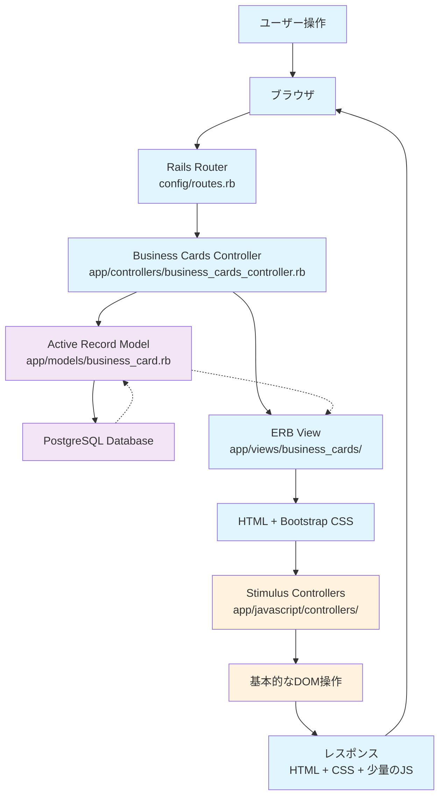
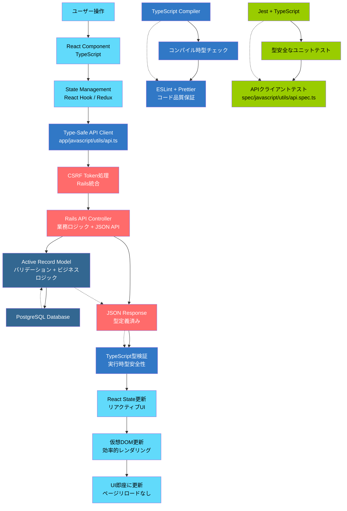
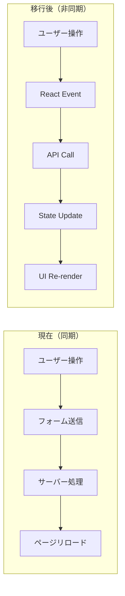
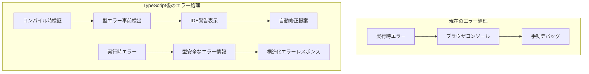
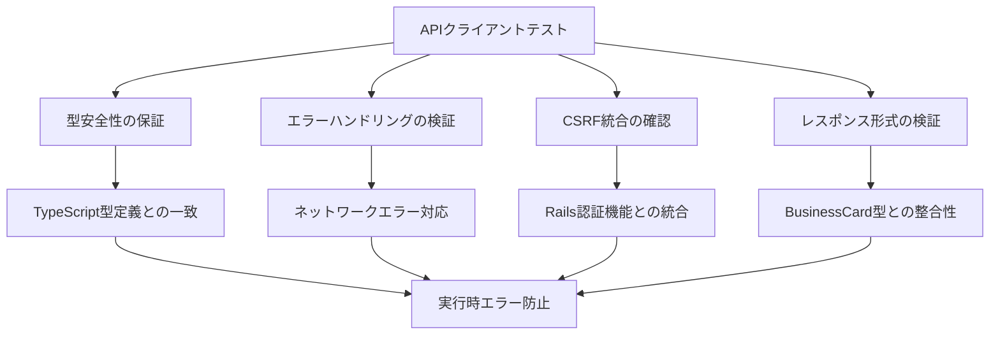
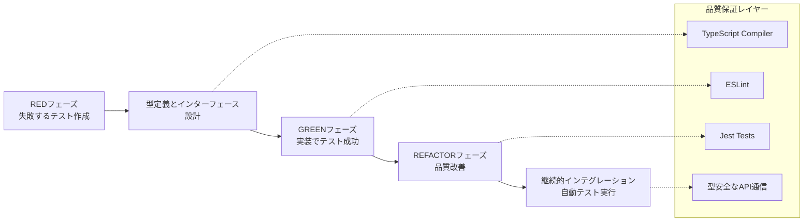

# TypeScript移行におけるワークフロー変化

## 概要
このドキュメントでは、現在のRails ERBベースのシステムから、TypeScript + React基盤へと段階的に移行する際のワークフロー変化について説明します。

## 1. 現在のシステムワークフロー（Rails ERB + Stimulus）

### 現在のシステムの特徴
- **サーバーサイドレンダリング**: ERBテンプレートでHTML生成
- **フルページリロード**: 各操作でページ全体を再読み込み
- **最小限のJavaScript**: Stimulusによる基本的なインタラクション
- **型安全性なし**: JavaScriptでの実行時エラーリスク
- **同期的処理**: リクエスト→レスポンス→ページリロード

## 2. TypeScript移行後のワークフロー（Rails API + TypeScript + React）

### TypeScript移行後の特徴
- **クライアントサイドレンダリング**: React Components による動的UI
- **SPA（Single Page Application）**: ページリロードなしの快適な操作感
- **型安全なAPI通信**: TypeScriptによる事前型チェック
- **リアルタイム更新**: 状態管理による即座のUI反映
- **開発体験向上**: コンパイル時エラー検出とIDE支援

## 3. 移行における主要な変化点

### 3.1 データフロー

### 3.2 エラーハンドリング

## 4. API Client テスト（spec/javascript/utils/api.spec.ts）の位置付け

### 4.1 テストが担保する品質

### 4.2 開発ワークフローにおける役割

## 5. 移行の段階的アプローチ

### Phase 1: TypeScript基盤構築（現在のタスク12）
- TypeScript設定とビルド環境
- 基本型定義（BusinessCard, User等）
- 型安全なAPIクライアント実装
- Jest + TypeScriptテスト環境

### Phase 2: React導入
- 単一コンポーネントからの置き換え開始
- 名刺一覧のReact化
- 状態管理の導入

### Phase 3: 全面移行
- 全ERBビューのReact化
- API化（Rails側のJSON対応）
- リアルタイム機能追加

## 6. 現在のテスト（api.spec.ts）が重要な理由

1. **型安全性の事前保証**: APIの入出力型が正しく定義されているか
2. **Rails統合の確認**: CSRF、認証等のRails機能との連携
3. **エラーハンドリング**: ネットワークエラーやAPIエラーの適切な処理
4. **将来の拡張基盤**: Reactコンポーネントが依存するAPI通信の品質保証

このテストによって、TypeScript移行の最初のステップである「型安全なAPI通信基盤」が確実に動作することを保証し、後続のReact実装時の信頼性を高めます。
